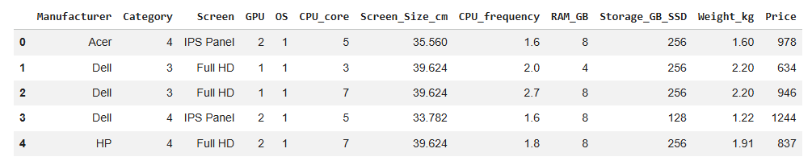
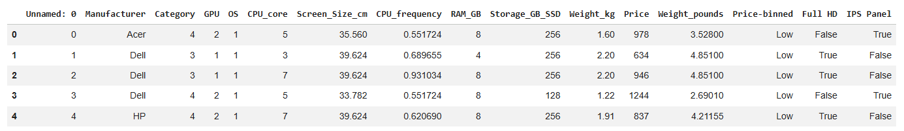
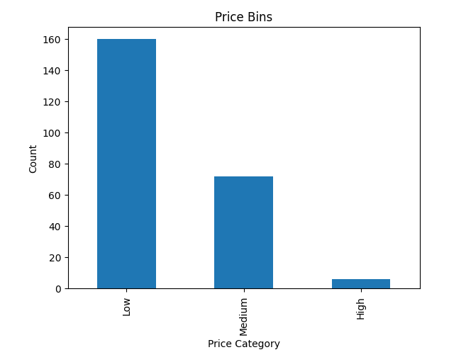

# laptop-pricing-data-wrangling
Data wrangling and preprocessing project using pandas: cleaning, transforming, and preparing a laptop pricing dataset for analysis and modeling.
# Data Wrangling – Laptop Pricing Dataset

## Overview
This project demonstrates end-to-end data wrangling using a laptop pricing dataset. The goal is to clean, transform, and prepare raw data for analysis by handling missing values, correcting data types, standardizing units, and creating new features.

## Tools & Libraries
- Python
- Pandas
- NumPy
- Matplotlib

## Dataset
The dataset includes laptop specifications such as:
- Manufacturer
- Category
- Screen type
- CPU details
- RAM and storage
- Weight
- Price

## Data Wrangling Process

### 1. Data Loading
- Loaded dataset from an external source using Pandas
- Removed the unnecessary `Unnamed: 0` column

### 2. Missing Value Handling
- Identified missing values using `.isnull()`
- Replaced missing numerical values with the mean:
  - `Weight_kg`
  - `Screen_Size_cm`

### 3. Data Type Correction
- Converted columns to appropriate formats for analysis

### 4. Feature Engineering
- Created `Weight_pounds` from `Weight_kg`
- Created `Price-binned` with Low, Medium, and High categories

### 5. Normalization
- Scaled `CPU_frequency` between 0 and 1

### 6. Categorical Encoding
- Converted `Screen` into indicator variables:
  - `Full HD`
  - `IPS Panel`

## Before & After

### Before Cleaning
Raw dataset immediately after loading.

### After Cleaning
Processed dataset with transformations applied.

## Visualization

### Price Category Distribution

## Key Takeaways
- Applied real-world data cleaning techniques
- Transformed raw data into an analysis-ready format
- Practiced feature engineering and normalization
- Prepared the dataset for machine learning workflows

## Insights
- Most laptops fall into the **Low price category**
- CPU frequency varies within a normalized range
- Most devices are relatively lightweight, around or under 2.5 kg

## Why This Matters
Data preprocessing is a critical step in any data workflow. This project demonstrates how to:
- Handle missing values
- Standardize and normalize numerical features
- Engineer new variables
- Encode categorical variables for modeling and analysis

## Files Included
- `data_wrangling_laptop_pricing.ipynb`
- `before_cleaning.png`
- `after_cleaning.png`
- `price_bins.png`
